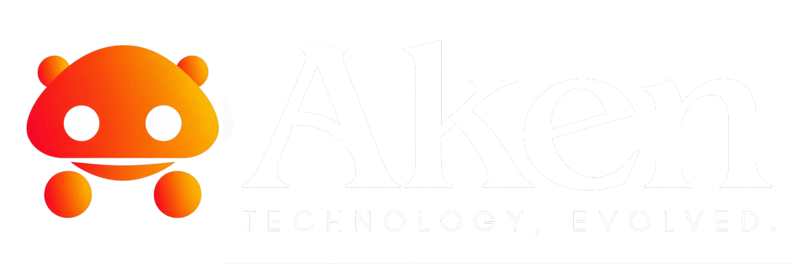
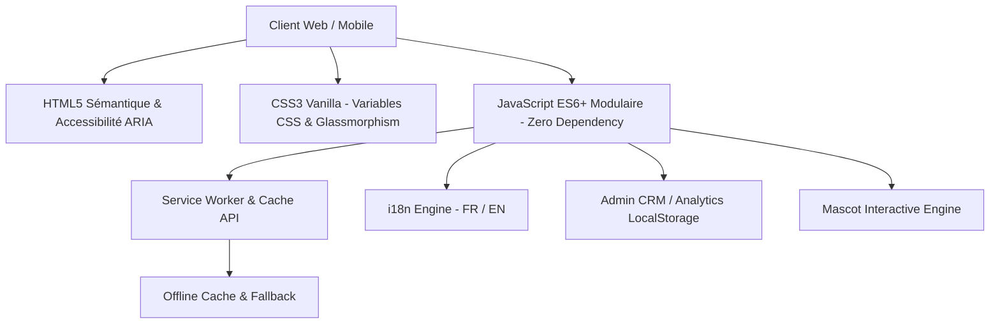

<p align="center">
  
</p>

<h1 align="center">Aken 2.0 — Solutions Digitales, Web & Mobile</h1>

<p align="center">
  <strong>Portfolio d'ingénierie logicielle haut de gamme, vitrine interactive, blog technique et suite CRM / Back-Office intégrée.</strong><br>
  <em>Conçu et développé à Bamako, Mali 🇲🇱 — Déployable à l'international.</em>
</p>

<p align="center">
  <a href="https://github.com/abdelkane-dev/Aken"></a>
  <a href="#-stack-technique"></a>
  <a href="#-pwa--offline-first"></a>
  <a href="#-espace-administration-crm--agenda"></a>
  <a href="LICENSE"></a>
</p>

---

## 📑 Sommaire

- [✨ Aperçu & Philosophie](#-aperçu--philosophie)
- [🌟 Fonctionnalités Clés](#-fonctionnalités-clés)
- [🛠️ Stack Technique](#️-stack-technique)
- [📁 Architecture du Répertoire](#-architecture-du-répertoire)
- [🚀 Démarrage Rapide](#-démarrage-rapide)
- [🎯 Détail des Modules](#-détail-des-modules)
  - [1. Expérience Utilisateur & Mascotte Interactive](#1-expérience-utilisateur--mascotte-interactive)
  - [2. Module Blog & Articles Techniques](#2-module-blog--articles-techniques)
  - [3. Suite CRM, Agenda & Tableau de Bord Admin](#3-suite-crm-agenda--tableau-de-bord-admin)
  - [4. PWA & Mode Hors-ligne](#4-pwa--mode-hors-ligne)
  - [5. Internationalisation Bilingue (FR / EN)](#5-internationalisation-bilingue-fr--en)
- [⚡ Optimisation & Performances Extrêmes](#-optimisation--performances-extrêmes)
- [🌐 Déploiement en Production](#-déploiement-en-production)
- [⚙️ Personnalisation & Configuration](#️-personnalisation--configuration)
- [👨‍💻 Auteur & Contact](#-auteur--contact)

---

## ✨ Aperçu & Philosophie

**Aken 2.0** est une vitrine technologique complète qui va bien au-delà d'un simple portfolio personnel. Conçu avec une approche **zéro dépendance externe lourde** (*Zero-Framework pure Vanilla Web*), il combine :

1. **Une identité visuelle saisissante** : Thème sombre néon/ambre haute fidélité, micro-animations réactives, glassmorphism, et typographies premium auto-hébergées.
2. **Un tunnel d'acquisition complet** : Présentation des offres, preuve sociale chiffrée, études de cas concrètes, lead magnet, formulaire de devis et canal WhatsApp direct.
3. **Une application web autonome (PWA)** : Installable sur smartphone et bureau, résiliente aux connexions réseau faibles ou absentes avec Service Worker et page offline dédiée.
4. **Un véritable back-office intégré** : Espace d'administration complet avec pipeline CRM des prospects, agenda interactif des projets, statistiques graphiques et palette de commande rapide.

---

## 🌟 Fonctionnalités Clés

| Fonctionnalité | Description |
| :--- | :--- |
| 🎨 **Design System Aken 2.0** | Esthétique *Dark Cyber-Orange* & *Light Clean*, glassmorphism subtil, boutons à lueur néon, badges technologiques flottants. |
| 🦊 **Mascotte Interactive Réactive** | Suivi dynamique du pointeur/souris, clignements naturels, changements d'expressions, bulles de dialogue interactives et option son. |
| 📖 **Blog & Veille Technologique** | Système d'articles complet (`blog.html`), filtrage par tags (Data, Mobile, Web, Sécurité), recherche temps réel et lecteur modal sans rechargement. |
| 💼 **Back-Office CRM & Agenda** | Espace de gestion sécurisé (`admin.html`) : kanban de leads, calendrier de jalons, sources de conversion, palette de commandes (`Ctrl+K`). |
| 🌍 **Internationalisation (i18n)** | Bascule instantanée Français 🇫🇷 / Anglais 🇬🇧 avec mémorisation des préférences utilisateur et fallback sécurisé. |
| 📱 **PWA & Résilience Réseau** | Service Worker v2, mise en cache stratégique, écran hors-ligne personnalisé (`offline.html`), icônes et raccourcis d'applications. |
| ⚡ **Vitesse & Éco-conception** | Aucune requête vers des CDN tiers bloquants, polices WOFF2 locales, images au format WebP ultra-compressées, chargement quasi-instantané (< 0.5s). |

---

## 🛠️ Stack Technique

Construit dans une optique de **pérennité**, de **rapidité maximale** et de **facilité de maintenance** :



- **Structure & SEO** : HTML5 sémantique, balisage OpenGraph, Twitter Cards, Schema.org JSON-LD pour les moteurs de recherche.
- **Style & Rendu** : CSS3 moderne, Flexbox, CSS Grid, custom properties (variables `:root`), animations CSS GPU-accelerated.
- **Logique Applicative** : JavaScript vanilla (ES6+), manipulation DOM native, zéro dépendance NPM côté client.
- **Stockage & Persistance** : `localStorage` chiffré/sécurisé pour le thème, la langue, les leads CRM et les événements de l'agenda.
- **Environnement de Dev** : Serveur de développement léger Node.js (`dev-server.js`) sans installation de packages tiers requise.

---

## 📁 Architecture du Répertoire

```
aken-portfolio/
├── 📄 index.html           # Page d'accueil, portfolio, offres & tunnel de conversion
├── 📄 blog.html            # Espace Blog, veille tech & lecteur d'articles modal
├── 📄 admin.html           # Dashboard d'administration, CRM, agenda & statistiques
├── 📄 offline.html         # Page de secours hors-ligne PWA
│
├── 📁 css/
│   └── 📄 style.css        # Feuille de style globale, design system & responsive
│
├── 📁 js/
│   ├── 📄 main.js          # Thème, navigation mobile, mascotte, modales & formulaires
│   ├── 📄 blog.js          # Logique du blog, recherche, filtrage & lecteur d'articles
│   ├── 📄 admin.js         # Gestionnaire CRM, agenda interactif, analytics & raccourcis
│   └── 📄 i18n.js          # Moteur de traduction dynamique FR / EN
│
├── 📁 lang/
│   ├── 📄 fr.json          # Dictionnaire des traductions françaises
│   └── 📄 en.json          # Dictionnaire des traductions anglaises
│
├── 📁 assets/
│   ├── 📁 fonts/           # Polices d'écriture auto-hébergées (WOFF2)
│   ├── 📄 logo.png         # Logo officiel Aken haute résolution (dark)
│   ├── 📄 logo.webp        # Version WebP ultra-optimisée du logo
│   ├── 📄 logo-light.png   # Logo Aken adapté au mode clair
│   ├── 📄 logo-light.webp  # Version WebP du logo clair
│   ├── 📄 mascot.svg       # Mascotte vectorielle originale
│   ├── 📄 og-cover.png     # Aperçu pour le partage sur réseaux sociaux (1200x630)
│   └── 📄 pwa-*.png        # Icônes pour l'installation Progressive Web App
│
├── 📄 manifest.json        # Manifeste PWA (nom, icônes, thème, raccourcis)
├── 📄 sw.js                # Service Worker pour le cache et l'expérience offline
├── 📄 dev-server.js        # Serveur de développement local natif Node.js
├── 📄 package.json         # Métadonnées du projet et scripts d'exécution
├── 📄 robots.txt           # Directives d'indexation pour les moteurs de recherche
└── 📄 sitemap.xml          # Plan de site XML pour l'optimisation SEO
```

---

## 🚀 Démarrage Rapide

### Prérequis
- Un navigateur web moderne (Chrome, Firefox, Safari, Edge).
- *Optionnel mais recommandé* : [Node.js](https://nodejs.org/) (version 14+) pour le serveur de développement local.

### 1. Cloner le dépôt
```bash
git clone https://github.com/abdelkane-dev/Aken.git
cd Aken
```

### 2. Lancer le serveur local
Le projet intègre son propre serveur de développement **sans aucune dépendance à installer** (`npm install` inutile) :

```bash
npm start
# ou
node dev-server.js
```

Le serveur démarrera automatiquement sur :
👉 **`http://localhost:3000`**

### 3. Navigation directe (Sans Node.js)
Vous pouvez également ouvrir directement `index.html` dans votre navigateur préféré par simple double-clic ou via l'extension VS Code *Live Server*.

---

## 🎯 Détail des Modules

### 1. Expérience Utilisateur & Mascotte Interactive
- **Mascotte intelligente** : Située en en-tête et dans les sections clés, elle suit les mouvements du curseur de l'utilisateur grâce à un calcul trigonométrique en temps réel sur les pupilles.
- **Réactions contextuelles** : Survoler les cartes d'offres ou les projets déclenche des animations spécifiques et des messages encourageants dans une bulle interactive.
- **Gestion du thème** : Bascule fluide entre le mode sombre (ambiance studio tech) et le mode clair (épuré et contrasté), avec détection automatique de la préférence système (`prefers-color-scheme`).

### 2. Module Blog & Articles Techniques
- **Lecteur modal immersif** : Les articles complets s'ouvrent dans une fenêtre modale optimisée avec typographie soignée, temps de lecture estimé et bouton de fermeture rapide.
- **Filtres & Recherche** : Possibilité de filtrer instantanément par catégorie (*Applications Mobiles*, *Architecture Web*, *Sécurité*, *Data & Cloud*).
- **Zéro 404** : Architecture dynamique native sans requêtes cassées.

### 3. Suite CRM, Agenda & Tableau de Bord Admin
Accessible via `admin.html` :
- 🔒 **Écran de verrouillage (PIN)** : Protection par code d'accès pour sécuriser l'espace gestionnaire.
- 📅 **Agenda Interactif** : Vue mensuelle avec création de jalons de projets, sessions de focus, et synchronisation locale.
- 👥 **CRM Prospects & Clients** : Suivi des demandes entrantes, changement de statut (*Nouveau*, *Contacté*, *Devis envoyé*, *Gagné*), bouton d'action directe WhatsApp et appel téléphonique.
- 📊 **Graphiques & Métriques** : Visualisation SVG du chiffre d'affaires prévisionnel, des taux de conversion et des sources d'acquisition.
- ⌨️ **Palette de commande (`Ctrl + K`)** : Raccourci universel pour exécuter des actions d'un simple coup de clavier.

### 4. PWA & Mode Hors-ligne
- **Installation 1-clic** : Conforme aux critères PWA Google Chrome et Apple Safari (A2HS - *Add to Home Screen*).
- **Service Worker v2** : Mise en cache intelligente des fichiers critiques (HTML, CSS, JS, polices WOFF2, logos).
- **Écran de secours** : Affichage d'une page élégante `offline.html` si le réseau est totalement indisponible.

### 5. Internationalisation Bilingue (FR / EN)
- Moteur i18n ultraléger dans `js/i18n.js`.
- Prise en charge des attributs HTML `data-i18n`, `data-i18n-placeholder` et `data-i18n-aria`.
- Basculement instantané sans rechargement de page.

---

## ⚡ Optimisation & Performances Extrêmes

- **Polices auto-hébergées** : Google Fonts locales converties en `.woff2` pour éliminer la latence DNS externe.
- **Images next-gen WebP** : Utilisation systématique de balises `<picture>` avec fallback `.png`.
- **En-têtes de cache stricts** : Configuration optimisée dans `vercel.json` et `dev-server.js` pour une mise en cache durable des assets statiques.
- **Score Lighthouse visé** : 95-100 dans toutes les catégories (Performance, Accessibilité, Bonnes Pratiques, SEO).

---

## 🌐 Déploiement en Production

Le projet est pré-configuré pour un déploiement instantané sur les principales plateformes cloud modernes :

### Déploiement sur Vercel (Recommandé)
Le fichier `vercel.json` est déjà configuré à la racine avec les routes de réécriture et les en-têtes HTTP de sécurité.
```bash
npx vercel --prod
```

### Déploiement sur Netlify
Glissez-déposez simplement le dossier complet `aken-portfolio` sur votre dashboard [Netlify Drop](https://app.netlify.com/drop).

### Déploiement sur GitHub Pages
1. Rendez-vous dans les **Paramètres (Settings)** de votre dépôt GitHub.
2. Section **Pages** → Source : `Deploy from a branch` → Choisissez `main` ou `feature/refonte-aken` et le dossier `/ (root)`.
3. Votre site sera accessible à l'adresse `https://abdelkane-dev.github.io/Aken/`.

---

## ⚙️ Personnalisation & Configuration

### Connecter le formulaire de contact
Pour recevoir directement les demandes de devis par e-mail sans serveur backend :
1. Créez un compte gratuit sur [Formspree](https://formspree.io) ou [Getform](https://getform.io).
2. Dans [`index.html`](index.html), modifiez l'attribut `action` du formulaire :
```html
<form class="contact-form" id="contact-form" action="https://formspree.io/f/VOTRE_FORM_ID" method="POST">
```

### Modifier le code PIN administrateur
Dans [`js/admin.js`](js/admin.js), modifiez la variable `ADMIN_PIN` pour définir votre propre code d'accès sécurisé.

---

## 👨‍💻 Auteur & Contact

**Aken (Abdel Kane)** — *Développeur Full-Stack & Ingénieur Solutions Digitales*

- 🌐 **Portfolio en ligne** : [abdelkane-dev.github.io/Aken](https://abdelkane-dev.github.io/Aken/)
- 💼 **GitHub** : [@abdelkane-dev](https://github.com/abdelkane-dev)
- 💬 **WhatsApp Pro** : [+223 XX XX XX XX](https://wa.me/22370000000)
- 📧 **E-mail Pro** : `contact@aken.dev` / `abdelkane.dev@gmail.com`

---

<p align="center">
  Fait avec passion, rigueur et créativité à Bamako 🇲🇱<br>
  <sub>© 2026 Aken. Tous droits réservés.</sub>
</p>
